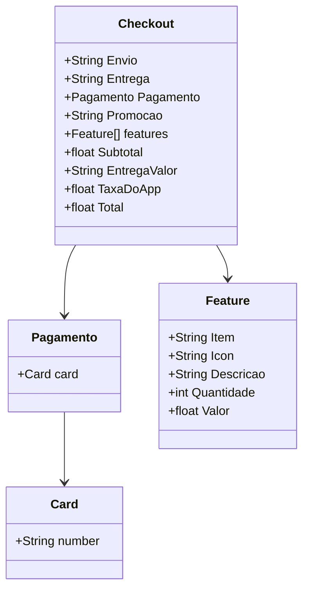

## Diagrama de Classes  
  

📚 API de Gerenciamento de Pedidos de Comida
Esta é uma API RESTful desenvolvida com Spring Boot que gerencia informações para executar um pedido de comida. Ela permite operações de consulta sobre cartões e promoções disponíveis, retornando dados em formato JSON para fácil integração com aplicações front-end ou clientes externos.  

✨ Funcionalidades  
Listar todos os cartões cadastrados  

Consultar um cartão específico pelo seu ID  

Listar todas as promoções disponíveis  

🚀 Tecnologias utilizadas  
Java 17  

Spring Boot 3  

Spring Web  

Spring Data JPA  

H2 Database (banco de dados em memória para desenvolvimento)  

📂 Endpoints principais  
GET /cards — Lista todos os cartões  

GET /cards/{id} — Retorna um cartão específico pelo ID  

GET /promocoes — Lista todas as promoções    

🎯 Observações
A aplicação roda, por padrão, na porta 8080.  

O banco de dados H2 é usado apenas para testes e desenvolvimento. Os dados são voláteis e são apagados a cada reinicialização.  

Para acessar o console do H2 (se habilitado):  
http://localhost:8080/h2-console  
(Use as configurações definidas no application-dev.yml.)  
