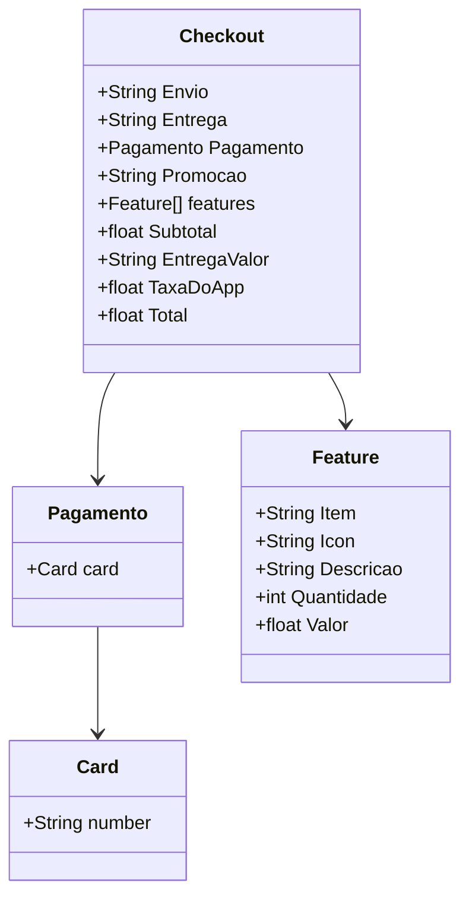

## Diagrama de Classes

```mermaid
classDiagram
  class Checkout {
    +String Envio
    +String Entrega
    +Pagamento Pagamento
    +String Promocao
    +Feature[] features
    +float Subtotal
    +String EntregaValor
    +float TaxaDoApp
    +float Total
  }

  class Pagamento {
    +Card card
  }

  class Card {
    +String number
  }

  class Feature {
    +String Item
    +String Icon
    +String Descricao
    +int Quantidade
    +float Valor
  }

  Checkout --> Pagamento
  Pagamento --> Card
  Checkout --> Feature
```
